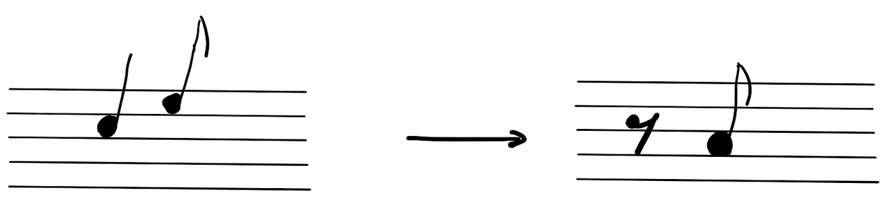

# Musical Variation Automata
A model for computation based on musical variation, developed for the ETH Zurich class "Models of Computation"

This is a python compiler for the musical variation automata.

## The Automata

The automata is based on a composing technique in classical music called "variation". An initial theme (melody) is changed based on some rules. This is called a variation. The composer reuses the initial theme through out his composition, but instead of the exact theme a variation is used. This is repeated multiple times.

The automata formalizes this by defining variation functions. A variation function takes a theme and defines the variation of the theme. An example would be:



The automata has a reading head. We start with an empty composition/score with only the theme writen on it. The header now starts to read the theme and searches a matching variation function out of an ordered list of variation functions. If a matching function is found the variation is written to the end of the score. The automata halts if no matching variation function is found.

The musical variation automata is turing complete.

More details and examples can be found in the <a href="slides.pdf"> slides</a>.

## Requirements

If you want to output a midi file, the MidiUtil library is required: https://midiutil.readthedocs.io/

## Functionality

To create a new automata, instantiate the Automata class with its name:
```
example_automata = Automata("example")
```

Notes and pauses are defined as follows:
```
c2_4 = Note("c2", 1 / 4) # c2 is the pitch, 1/4 is the length
e2_8 = Note("e2", 1 / 8) 
a2_8 = Note("a2", 1 / 8) 
p_8 = Pause(1 / 8)
```

To define the variation function:


```
va_function = VariationFunction([c2_4, e2_8], [p_8, a2_8])
```

This variation function can now be added to the automata via:
```
example_automata.add_variation_function(va_function)
```
A theme is added with:
```
example_automata.add_theme([c2_4, e2_8])
```

And now the automata can be run with:
```
ADD_mva.describe() # print a summarization of the automata and its variation functions
ADD_mva.run(verbose_mode=True) # run the automata with step by step verbose mode
```

An example of the functions **BINARY ADDITION** and **AND** can be found <a href="src/example.py"> here</a>.

